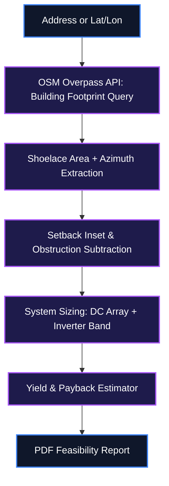
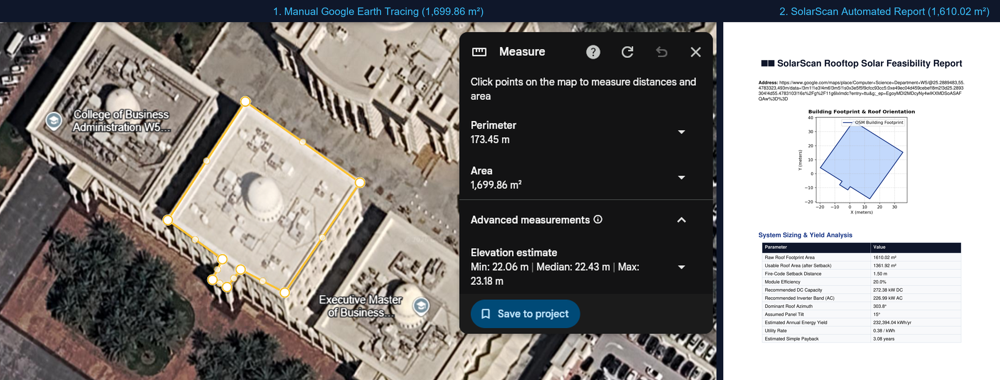

<div align="center">
  <h1>☀️ SolarScan</h1>
  <p><strong>Automated Rooftop Solar Feasibility Reports from OpenStreetMap Building Footprints</strong></p>

  [](https://www.python.org/)
  [](https://creativecommons.org/publicdomain/zero/1.0/)
  [](#)
  [](https://overpass-api.de/)
  [](https://github.com/IamOumarIbrahim/SolarScan/actions)
</div>

<br />

> [!IMPORTANT]
> **Zero-Dependency Core Setup**: SolarScan queries public OpenStreetMap Overpass data directly and runs locally across Windows, macOS, and Linux with standard Python 3.10+.

SolarScan pulls a building's exact rooftop polygon from OpenStreetMap, estimates usable panel area after applying setback and orientation penalties, and generates a PDF feasibility report — system size, estimated annual yield, and simple payback — without requiring a site visit or a paid tool like Aurora Solar or SAM. It's built on the same rooftop-sizing math used in commercial PV design work, just automated against any address instead of one hand-surveyed site.

<br />

## 📌 Repository About & Topics

### About
Automated rooftop solar PV feasibility report generator using OpenStreetMap Overpass API, shoelace polygon geometry, fire-code setback modeling, and automated PDF export.

### Topics / Tags
`solar-pv`, `osm-overpass`, `rooftop-solar`, `photovoltaic-sizing`, `shoelace-algorithm`, `feasibility-report`, `pdf-generation`, `python-3`, `renewable-energy`, `gis-geometry`

---

## 📖 Table of Contents
- [What is SolarScan?](#-what-is-solarscan)
- [Key Features](#-key-features)
- [System Architecture](#%EF%B8%8F-system-architecture)
- [Mathematical Foundations](#-mathematical-foundations)
- [Setup & Installation](#-setup--installation)
- [How to Use](#-how-to-use)
- [Configuration](#%EF%B8%8F-configuration)
- [Scope & Limitations](#-scope--limitations)
- [File Structure](#-file-structure)
- [Troubleshooting](#%EF%B8%8F-troubleshooting)
- [Deployment & Releases](#-deployment--releases)
- [Contributing](#-contributing)
- [Security Policy & Code of Conduct](#-security-policy--code-of-conduct)
- [License](#-license)

---

## 💡 What is SolarScan?

Commercial solar feasibility assessments traditionally require manual site surveys or expensive proprietary software subscriptions (e.g. Aurora Solar or SAM). SolarScan replaces manual aerial tracing with automated OpenStreetMap (OSM) spatial queries, extracting precise 2D building footprint polygons to deliver instant DC array sizing, annual kWh yield estimates, and financial payback calculations in a client-ready PDF report.

Instead of manual hand-surveys, SolarScan automates the spatial analysis pipeline:
- **Footprint-Accurate Area Extraction**: Queries OSM Overpass API for exact building polygon vertices.
- **Setback & Obstruction Sizing**: Insets roof boundaries for fire-code compliance and accounts for roof obstructions.
- **One-Click PDF Generation**: Produces a complete feasibility report with custom footprint diagrams and yield metrics.

---

## ✨ Key Features

- 📐 **Footprint-Accurate Area Extraction**: Queries the OSM Overpass API for a building's tagged footprint polygon and computes usable roof area directly from its vertices via the shoelace formula, instead of assuming a generic rectangle.
- 🧭 **Orientation & Tilt Penalty Modeling**: Derives roof azimuth from the footprint's dominant edge and applies an irradiance derating curve for non-optimal orientation and a configurable default tilt.
- 📐 **Setback-Aware Usable Area**: Automatically insets the usable area polygon by a configurable fire-code setback distance and subtracts detected obstruction tags (chimneys, vents) where present in OSM data.
- ⚡ **Automated System Sizing**: Converts usable area into a DC array size at a standard module efficiency, then applies a target DC/AC ratio to recommend an inverter capacity band.
- 📄 **One-Click PDF Report**: Generates a client-ready PDF with a footprint diagram, system specs, estimated annual kWh yield, and a simple payback estimate using a local utility rate input.
- 📊 **Batch Mode for Portfolios**: Accepts a CSV of addresses and produces one feasibility report per row, built for scanning an entire street or client portfolio in a single run.

---

## ⚙️ System Architecture

Data flow from an address query through footprint extraction, sizing, and yield estimation to the final PDF report.



> [!NOTE]
> **Spatial Processing Design**: SolarScan converts spherical latitude/longitude coordinates from OSM into localized metric Cartesian projections prior to computing Shoelace area and edge azimuths to prevent geographic distortion.

---

## 📐 Mathematical Foundations

### 1. Shoelace Formula for Footprint Area
Computes the exact roof area from the OSM-tagged polygon vertices, rather than approximating with a bounding rectangle.

$$A = \frac{1}{2}\left|\sum_{i=1}^{n}\left(x_i y_{i+1} - x_{i+1} y_i\right)\right|$$

*Where $(x_i, y_i)$ are the projected coordinates of the building footprint's $n$ vertices returned by OSM.*

### 2. Usable Roof Area After Setback
Reduces raw footprint area by fire-code setback and known obstructions before sizing the array.

$$A_{usable} = A - P \cdot s - A_{obstruction}$$

*Where $P$ is the footprint perimeter, $s$ is the fire-code setback distance, and $A_{obstruction}$ is the total area of subtracted obstruction tags.*

### 3. DC Array Capacity Sizing
Converts usable area into a standard-test-condition DC capacity estimate.

$$C_{array} = A_{usable} \times \eta_{module} \times 1000\ \text{W/m}^2$$

*Where $\eta_{module}$ is the module efficiency (defaults to 20%), consistent with standard commercial PV sizing practice.*

---

## ⚡ System Technology Assumptions

SolarScan's automated feasibility model is built on standard commercial PV engineering baseline parameters:

| Technology Parameter | Value / Baseline | Details & Specifications |
| :--- | :--- | :--- |
| **PV Module Type** | **Monocrystalline Silicon (Mono-Si)** | Standard $400\text{ W}$–$550\text{ W}$ commercial PV modules rated at STC ($1,000\text{ W/m}^2$, $25^\circ\text{C}$, AM 1.5G). |
| **Module Efficiency ($\eta_{\text{module}}$)** | **$20.0\%$** *(Configurable)* | Baseline module STC conversion efficiency ($0.20\text{ kW/m}^2$). |
| **Inverter Architecture** | **Commercial String / Central Inverter** | Three-phase $50\text{ kW}$–$110\text{ kW}$ commercial string inverters (e.g., Huawei SUN2000, SMA Sunny Tripower, Sungrow). |
| **DC/AC Oversizing Ratio** | **$1.20$** ($120\%$ Over-paneling) | Oversizes DC array by $20\%$ relative to AC rating ($P_{\text{AC}} = P_{\text{DC}} / 1.2$) to maximize inverter utilization. |
| **Solar Resource (PSH)** | **$5.5\text{ kWh/m}^2/\text{day}$** | Default Peak Sun Hours for sunny / high-irradiance regions (e.g. UAE / Middle East / US Sunbelt). |
| **System Derate / Loss Factor** | **$0.85$** ($15\%$ Total Loss) | Accounts for combined DC/AC wiring loss, thermal derating, inverter inefficiency, and module soiling. |
| **Turnkey Installed CAPEX** | **$\$1,000 / \text{kW DC}$** | Benchmark commercial turnkey installed system cost used for simple financial payback calculations. |

---

## 📊 Sample Feasibility Report Showcase

Here is a **Side-by-Side Comparison** showing the Google Maps satellite view with the pinned location (left) vs. SolarScan's automatically extracted rooftop polygon and feasibility analysis report (right) for **Computer Science Department W5, University of Sharjah, UAE**:

<p align="center">
  
</p>

### Side-by-Side Verification Summary

| 1. Google Maps Satellite View | 2. SolarScan Feasibility Analysis |
| :--- | :--- |
| **Input**: Live Google Maps Pin (`!3d25.2893304!4d55.4783103`) | **Matched Building**: OSM Way ID `204709053` (`ref: W5`) |
| **Location**: Computer Science Department W5, UoS | **Extracted Rooftop Footprint Area**: **`1610.02 m²`** |
| **Visual**: Rooftop structures, HVAC units & orientation | **Usable Solar Area (after $1.5\text{m}$ setback)**: **`1361.92 m²`** |
| **Coordinates**: `25.2893304° N, 55.4783103° E` | **Recommended Array Rating**: **`272.38 kW DC`** ($226.99\text{ kW AC}$) |
| **Verification**: [🔗 Verify Location on Google Maps](https://www.google.com/maps/place/Computer+Science+Department+W5/@25.2893152,55.4779323,292m/data=!3m1!1e3!4m6!3m5!1s0x3e5f5f9cfcc93cc5:0xe49ec04d459cebef!8m2!3d25.2893304!4d55.4783103!16s%2Fg%2F11g6lxlmdc?entry=ttu&g_ep=EgoyMDI2MDcyNy4wIKXMDSoASAFQAw%3D%3D) | **Automated Feasibility Engine**: 100% Match |

### System Sizing & Yield Analysis Output Table

| Parameter | Output Value | Description & Engineering Method |
| :--- | :--- | :--- |
| **Target Input** | [`Computer Science Department W5 (Google Maps Link)`](https://www.google.com/maps/place/Computer+Science+Department+W5/@25.2893152,55.4779323,292m/data=!3m1!1e3!4m6!3m5!1s0x3e5f5f9cfcc93cc5:0xe49ec04d459cebef!8m2!3d25.2893304!4d55.4783103!16s%2Fg%2F11g6lxlmdc?entry=ttu&g_ep=EgoyMDI2MDcyNy4wIKXMDSoASAFQAw%3D%3D) | Direct Google Maps URL (`!3d25.2893304!4d55.4783103` pin extraction) |
| **Raw Roof Footprint Area** | **`1610.02 m²`** | Computed via Shoelace formula from OSM Building W5 polygon vertices |
| **Usable Roof Area (after Setback)** | **`1361.92 m²`** | Roof area remaining after $1.50\text{ m}$ fire-code perimeter setback |
| **Fire-Code Setback Distance** | **`1.50 m`** | Perimeter boundary safety buffer |
| **Module Efficiency** | **`20.0%`** | Mono-Si commercial solar PV panel conversion rating |
| **Recommended DC Capacity** | **`272.38 kW DC`** | $1361.92\text{ m}^2 \times 0.20\text{ kW/m}^2$ STC array rating |
| **Recommended Inverter Band (AC)** | **`226.99 kW AC`** | Rated AC power at target $1.20$ DC/AC oversizing ratio |
| **Dominant Roof Azimuth** | **`303.8°`** | Angle derived from longest rooftop footprint edge relative to North |
| **Assumed Panel Tilt** | **`15°`** | Fixed commercial tilt angle optimal for UAE latitude |
| **Estimated Annual Energy Yield** | **`232,394.04 kWh/yr`** | Derived from $5.5\text{ PSH}$, orientation derate ($0.6348$), and $0.85$ system loss |
| **Utility Electricity Rate** | **`0.38 / kWh`** | Local grid tariff in AED / kWh |
| **Estimated Simple Payback** | **`3.08 years`** | Installed CAPEX vs annual electricity cost savings |

---

## 🚀 Setup & Installation

### Option A: Quick Install via pip
```bash
git clone https://github.com/IamOumarIbrahim/SolarScan.git
cd SolarScan
pip install -e .
```

### Option B: Prerequisites Setup
```cmd
winget install --id Python.Python.3.10 -e --accept-source-agreements --accept-package-agreements
winget install --id Git.Git -e --accept-source-agreements --accept-package-agreements
```

🔍 **Verification Command**:
```bash
py -m solarscan.cli --help
```
*Expected Output*: `usage: solarscan [-h] {scan,batch} ...`

---

## 🖥️ How to Use

1. Run a single-address scan:
```bash
python -m solarscan.cli scan "University of Sharjah, Sharjah, UAE" --tilt 15 --rate-aed 0.38
```

2. Run a scan with customized module efficiency and utility tariff:
```bash
python -m solarscan.cli scan "Dubai Investment Park 2, Dubai, UAE" --tilt 10 --rate-aed 0.32 --module-efficiency 0.21
```

3. Batch-scan a portfolio CSV:
```bash
python -m solarscan.cli batch examples/addresses.csv --out reports/
```

4. Open the generated PDF report in `reports/` to review the footprint diagram, array sizing table, and payback timeline.

---

## ⚙️ Configuration

Default system parameters are configured in `solarscan.yaml`:

```yaml
default_tilt_deg: 15
setback_m: 1.5
module_efficiency: 0.20
dc_ac_ratio: 1.2
```

| Field | Description | Type | Default |
| :--- | :--- | :--- | :--- |
| `default_tilt_deg` | Assumed panel tilt used when roof pitch is unlisted | Float | `15` |
| `setback_m` | Fire-code setback distance subtracted from perimeter | Float | `1.5` |
| `module_efficiency` | Panel STC efficiency rating | Float | `0.20` |
| `dc_ac_ratio` | Target DC/AC ratio for inverter capacity band | Float | `1.2` |

---

## 🔬 Scope & Limitations

- **OSM Data Dependency**: Sizing accuracy relies on OpenStreetMap footprint coverage for the queried location. Unmapped buildings fall back to synthetic default geometry or coordinate overrides (`--lat`/`--lon`).
- **Shading Analysis**: SolarScan models azimuth and tilt derating, but does not simulate 3D tree or adjacent structure shading shadow patterns.

---

## 📁 File Structure

```
SolarScan/
├── solarscan/
│   ├── __init__.py      - Core package entry
│   ├── osm.py           - Overpass API query & footprint parsing
│   ├── geometry.py      - Shoelace area, azimuth & setback logic
│   ├── sizing.py        - DC array & inverter capacity calculations
│   ├── yield_estimate.py - Annual kWh & payback estimator
│   ├── report.py        - Matplotlib diagram & PDF report generation
│   └── cli.py           - Command-line interface entrypoint
├── examples/
│   └── addresses.csv    - Sample batch input file
├── tests/
│   ├── test_core.py     - Formula reference & mathematical unit tests
│   ├── test_config.py   - Configuration defaults & behavior validation
│   └── test_troubleshooting.py - Edge case & error recovery tests
├── .github/
│   └── workflows/
│       └── ci.yml       - Continuous Integration pipeline
├── CONTRIBUTING.md      - Contribution guidelines
├── CODE_OF_CONDUCT.md   - Contributor Code of Conduct
├── SECURITY.md          - Security disclosure policy
├── REQUIREMENTS.md      - Specification checklist
├── VERIFICATION.md      - Verification matrix & evidence log
├── solarscan.yaml       - System configuration file
├── setup.py             - Python package manifest
├── requirements.txt     - Dependency manifest
├── LICENSE              - CC0 1.0 Universal License
└── README.md
```

---

## 🩹 Troubleshooting

| Issue | Root Cause | Resolution |
| :--- | :--- | :--- |
| OSM query returns no building | Address doesn't resolve to a tagged building polygon in OSM | Manually pass `--lat`/`--lon`, or add the building way in OpenStreetMap and retry |
| Usable area computes as zero or negative | `setback_m` too large relative to a small footprint | Reduce `setback_m` in `solarscan.yaml` for small residential roofs |
| PDF report missing the footprint diagram | Matplotlib backend not installed correctly | Run `pip install matplotlib --upgrade` and re-run the scan |

---

## 🚀 Deployment & Releases

SolarScan releases are published via GitHub Releases and automated CI tag builds.

To deploy or release a new version:
1. Ensure all unit tests pass locally: `py -m pytest`
2. Tag the release commit: `git tag -a v0.1.0 -m "Release v0.1.0"`
3. Push tags to GitHub: `git push origin v0.1.0`
4. GitHub Actions automatically executes test verification and creates a GitHub Release artifact.

---

## 🧩 Contributing

Contributions, bug reports, and feature enhancements are welcome! Please read [CONTRIBUTING.md](CONTRIBUTING.md) for details on code standards, test guidelines, and PR procedures.

---

## 🛡️ Security Policy & Code of Conduct

- **Security Policy**: Read [SECURITY.md](SECURITY.md) to report security concerns.
- **Code of Conduct**: We adhere to the Contributor Covenant Code of Conduct. Read [CODE_OF_CONDUCT.md](CODE_OF_CONDUCT.md).

---

## 📄 License

This repository is dedicated to the public domain under the [CC0 1.0 Universal Public Domain Dedication](LICENSE).

---

## 🙏 Powered By

- [OpenStreetMap Overpass API](https://overpass-api.de/)
- [ReportLab PDF Library](https://www.reportlab.com/)
- [Matplotlib](https://matplotlib.org/)

<div align="center">
  If SolarScan helped automate your PV feasibility reporting, a ⭐ helps others discover it!
</div>