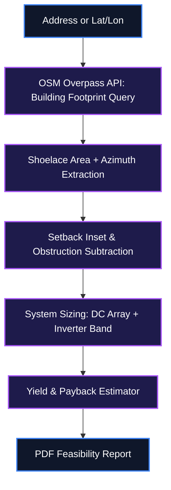

# ☀️ SolarScan — Automated Rooftop Solar Feasibility Reports from OpenStreetMap Building Footprints

[](https://creativecommons.org/publicdomain/zero/1.0/)
[](#)
[](#)
[](#)

<p align="center">
  
</p>

SolarScan pulls a building's exact rooftop polygon from OpenStreetMap, estimates usable panel area after applying setback and orientation penalties, and generates a PDF feasibility report — system size, estimated annual yield, and simple payback — without requiring a site visit or a paid tool like Aurora Solar or SAM. It's built on the same rooftop-sizing math used in commercial PV design work, just automated against any address instead of one hand-surveyed site.

---

## 📖 Table of Contents
- [Key Features](#-key-features)
- [System Architecture](#%EF%B8%8F-system-architecture)
- [Mathematical Foundations](#-mathematical-foundations)
- [Quick Setup & Installation](#-quick-setup--installation)
- [How to Use](#-how-to-use)
- [Configuration](#%EF%B8%8F-configuration)
- [File Structure](#-file-structure)
- [Troubleshooting](#%EF%B8%8F-troubleshooting)
- [License](#-license)

---

## ✨ Key Features

- **Footprint-Accurate Area Extraction**: Queries the OSM Overpass API for a building's tagged footprint polygon and computes usable roof area directly from its vertices via the shoelace formula, instead of assuming a generic rectangle.
- **Orientation & Tilt Penalty Modeling**: Derives roof azimuth from the footprint's dominant edge and applies an irradiance derating curve for non-optimal orientation and a configurable default tilt.
- **Setback-Aware Usable Area**: Automatically insets the usable area polygon by a configurable fire-code setback distance and subtracts detected obstruction tags (chimneys, vents) where present in OSM data.
- **Automated System Sizing**: Converts usable area into a DC array size at a standard module efficiency, then applies a target DC/AC ratio to recommend an inverter capacity band.
- **One-Click PDF Report**: Generates a client-ready PDF with a footprint diagram, system specs, estimated annual kWh yield, and a simple payback estimate using a local utility rate input.
- **Batch Mode for Portfolios**: Accepts a CSV of addresses and produces one feasibility report per row, built for scanning an entire street or client portfolio in a single run.

---

## ⚙️ System Architecture

Data flow from an address query through footprint extraction, sizing, and yield estimation to the final PDF report.



---

## 📐 Mathematical Foundations

### 1. Shoelace Formula for Footprint Area
Computes the exact roof area from the OSM-tagged polygon vertices, rather than approximating with a bounding rectangle.

$$A = \frac{1}{2}\left|\sum_{i=1}^{n}\left(x_i y_{i+1} - x_{i+1} y_i\right)\right|$$

*Where $(x_i, y_i)$ are the projected coordinates of the building footprint's $n$ vertices returned by OSM.*

### 2. Usable Roof Area After Setback
Reduces raw footprint area by fire-code setback and known obstructions before sizing the array.

$$A_{usable} = A - P \cdot s - A_{obstruction}$$

*Where $P$ is the footprint perimeter, $s$ is the fire-code setback distance, and $A_{obstruction}$ is the total area of subtracted obstruction tags.*

### 3. DC Array Capacity Sizing
Converts usable area into a standard-test-condition DC capacity estimate.

$$C_{array} = A_{usable} \times \eta_{module} \times 1000\ \text{W/m}^2$$

*Where $\eta_{module}$ is the module efficiency (defaults to 20%), consistent with standard commercial PV sizing practice.*

---

## 🚀 Quick Setup & Installation

### Prerequisites (Zero-Dependency Setup)
This guide assumes a clean machine with **no pre-installed tools**.

```cmd
winget install --id Python.Python.3.10 -e --accept-source-agreements --accept-package-agreements
winget install --id Git.Git -e --accept-source-agreements --accept-package-agreements
```

🔍 **Verification Command**:
```cmd
python --version
```
*Expected Output*: `Python 3.10.x`

### Clone & Install
```bash
git clone https://github.com/IamOumarIbrahim/SolarScan.git
cd SolarScan
pip install -r requirements.txt
```

### Run
```bash
python -m solarscan.cli scan "123 Example St, Sharjah, UAE"
```

---

## 🛠️ How to Use

1. Run a single-address scan: `solarscan scan "University of Sharjah, Sharjah, UAE" --tilt 15 --rate-aed 0.38`.
2. Or batch-scan a CSV of addresses: `solarscan batch addresses.csv --out reports/`.
3. Open the generated PDF in `reports/` — it includes the extracted footprint diagram, sizing table, and payback estimate.

```bash
# Example command
python -m solarscan.cli scan "Dubai Investment Park 2, Dubai, UAE" --tilt 10 --rate-aed 0.32 --module-efficiency 0.21
```

---

## ⚙️ Configuration

`solarscan.yaml`:

```yaml
default_tilt_deg: 15
setback_m: 1.5
module_efficiency: 0.20
dc_ac_ratio: 1.2
```

| Field | Description |
| :--- | :--- |
| `default_tilt_deg` | Assumed panel tilt used when a roof pitch can't be inferred from OSM data |
| `setback_m` | Fire-code setback distance subtracted from the footprint perimeter |
| `module_efficiency` | Panel efficiency used in the DC array capacity calculation |
| `dc_ac_ratio` | Target DC/AC ratio used to recommend an inverter capacity band |

---

## 📁 File Structure

SolarScan/
├── solarscan/
│ ├── osm.py - Overpass API query and footprint parsing
│ ├── geometry.py - Shoelace area, azimuth, and setback inset logic
│ ├── sizing.py - DC array and inverter capacity calculations
│ ├── yield_estimate.py - Annual kWh and payback estimator
│ └── report.py - PDF report generation
├── examples/addresses.csv - Sample batch input
├── tests/ - Pytest suite
├── solarscan.yaml
└── README.md

---

## 🛠️ Troubleshooting

| Issue | Root Cause | Resolution |
| :--- | :--- | :--- |
| OSM query returns no building | Address doesn't resolve to a tagged building polygon in OSM | Manually pass `--lat`/`--lon`, or add the building way in OpenStreetMap and retry |
| Usable area computes as zero or negative | `setback_m` too large relative to a small footprint | Reduce `setback_m` in `solarscan.yaml` for small residential roofs |
| PDF report missing the footprint diagram | Matplotlib backend not installed correctly | Run `pip install matplotlib --upgrade` and re-run the scan |

---

## 📄 License
This repository is licensed under the [CC0 1.0 Universal (CC0 1.0) Public Domain Dedication](LICENSE).