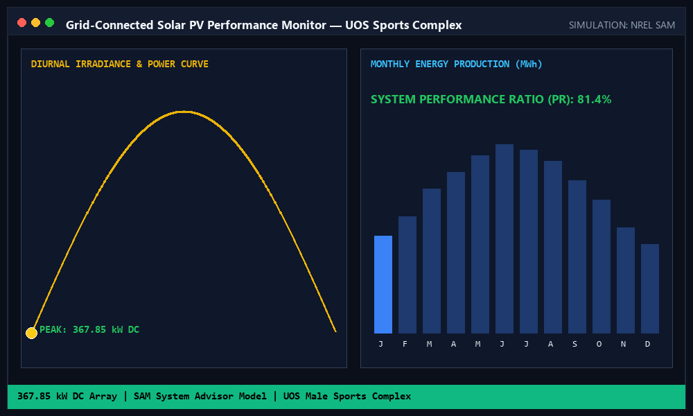
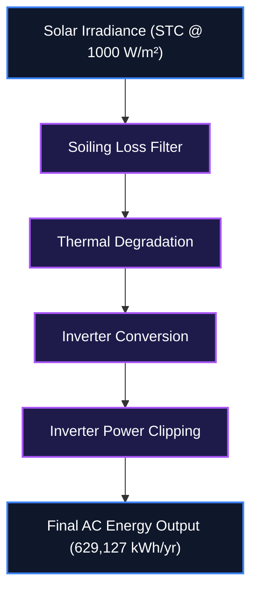

<div align="center">
  <h1>Solar PV System Design</h1>
  <p><strong>Grid-Connected Solar PV System Design & Performance Analysis for the University of Sharjah</strong></p>

  [](main.tex)
  [](https://creativecommons.org/publicdomain/zero/1.0/)
  [](https://github.com/IamOumarIbrahim/solar-pv-system-design/actions/workflows/ci.yml)

  <br />
  [](#)
</div>

<p align="center">
  
</p>

> [!IMPORTANT]
> **No setup assumed**: This project includes both compiled PDF documentation for immediate viewing and raw LaTeX source files for modification.

Solar PV System Design is a professional-grade, commercial-scale photovoltaic (PV) system design and performance simulation conducted for the University of Sharjah (UOS) Male Sports Complex, Sharjah, UAE. The design employs NREL's System Advisor Model (SAM) to configure and optimize a 367.85 kW DC double-tilted roof-mounted array.

<br />

## Table of Contents
- [What is Solar PV System Design?](#-what-is-solar-pv-system-design)
- [Key Features](#-key-features)
- [System Architecture](#-system-architecture)
- [Mathematical / Technical Formulation](#-mathematical--technical-formulation)
- [Setup & Installation](#-setup--installation)
- [How to Use](#-how-to-use)
- [Reference Tables](#-reference-tables)
- [Scope & Limitations](#-scope--limitations)
- [Academic Context](#-academic-context)
- [File Structure](#-file-structure)
- [Troubleshooting](#-troubleshooting)
- [Contributing](#-contributing)
- [License](#-license)

---

## What is Solar PV System Design?

Designing commercial-scale solar installations often suffers from poor hardware alignment and inadequate modeling of environmental factors. Solar PV System Design provides a realistic commercial PV system design with real-world meteorological data to ensure optimal output.

Instead of theoretical academic examples, Solar PV System Design validates real hardware setups:
- **Capacity Planning**: Provides a 367.85 kW combined capacity across both subarrays using 1,116 Trina Solar TSM-330 modules.
- **Optimization**: Utilizes a highly optimized 1.23 DC/AC ratio with 5 × SMA Sunny Tripower 60kW inverters to minimize clipping.
- **Validation**: Evaluates system behavior using high-resolution meteorological data, achieving a performance ratio (PR) of 0.78 with comprehensive loss profiling.

---

## Key Features

- **System Capacity**: Provides a 367.85 kW combined capacity across both subarrays using 1,116 Trina Solar TSM-330 modules.
- **Inverter Sizing**: Utilizes a highly optimized 1.23 DC/AC ratio with 5 × SMA Sunny Tripower 60kW inverters to minimize clipping.
- **Array Layout**: Adopts a double tilted roof configuration perfectly geometrically aligned to minimize shading and preserve structural margins.
- **Performance Validation**: Evaluates system behavior using high-resolution meteorological data, achieving a performance ratio (PR) of 0.78 with comprehensive loss profiling.

---

## System Architecture

Data flow from solar irradiance input through processing stages to the final AC energy output.



> [!NOTE]
> **DC/AC Ratio Optimization**: The system uses a 1.23 DC/AC ratio to minimize clipping while maximizing inverter utilization.

---

## Mathematical / Technical Formulation

### 1. System Size Capacity Limits
Calculates the maximum raw capacity limit based on measured roof area and a standard module efficiency of 17%.

$$C_{\text{array}} = A_{\text{roof}} \times \eta_{\text{module}} \times 1000 \text{ W/m}^2$$

*Where:*
- $C_{\text{array}}$ — the array capacity
- $A_{\text{roof}}$ — the available roof area
- $\eta_{\text{module}}$ — the module efficiency

### 2. Inverter Sizing & Ratio Optimization
Determines the target inverter AC capacity by applying a commercial DC/AC ratio of approximately 1.2.

$$\text{Target Inverter AC Capacity} = \frac{\text{System Size (DC W)}}{1.2}$$

*Where:*
- $\text{System Size (DC W)}$ — the total DC power output
- $1.2$ — the optimal DC/AC ratio

### 3. Module String Configuration Limits
Evaluates the bounds for maximum and minimum modules per string using inverter DC voltage limits.

$$\text{Max Modules per String} = \frac{\text{Inverter Max V}_{DC}}{\text{Module } V_{oc}}$$

*Where:*
- $\text{Inverter Max V}_{DC}$ — the upper voltage threshold
- $V_{oc}$ — the module open-circuit voltage

---

## Setup & Installation

### Option A: 1-Click Setup (Windows)
```cmd
winget install --id MiKTeX.MiKTeX -e --accept-source-agreements --accept-package-agreements && winget install --id Git.Git -e --accept-source-agreements --accept-package-agreements
```
Automatically installs MiKTeX and Git via winget.

### Option B: Manual Installation

```bash
git clone https://github.com/IamOumarIbrahim/solar-pv-system-design.git
cd solar-pv-system-design
pdflatex main.tex
```

 **Verification Command**:
```bash
pdflatex --version
```
*Expected Output*: `MiKTeX-pdfTeX 4.x (or similar version output)`

---

## How to Use

1. Open `PV-project.pdf` directly in any PDF viewer to read the final compiled report.
2. Review the detailed System Advisor Model profile and sizing configurations in `SAM.pdf`.
3. To modify or compile the report yourself, edit `main.tex` and recompile using pdflatex.

```bash
# Compile LaTeX source code
pdflatex main.tex
```

---

## Reference Tables

| Component | Specification | Quantity |
| :--- | :--- | :--- |
| Solar Modules | Trina Solar TSM-330 | 1116 |
| Inverters | SMA Sunny Tripower 60kW | 5 |

---

## Scope & Limitations

- **Simulation-based**: The performance validation is purely software-based and does not include hardware implementation.
- **Specific Location**: Meteorological data is tailored specifically to Sharjah, UAE, and would need adjustment for other locations.

---

## Academic Context

This project was developed for **University of Sharjah (UOS)** at **University of Sharjah**.
- **Author**: Oumar Ibrahim
- **Faculty/Department**: Engineering
- **Date**: 2024

---

## File Structure

```
solar-pv-system-design/
├── assets/ - Contains project assets like demo.gif
├── main.tex - The complete LaTeX source code compiled using the IEEEtran standard conference template
├── SAM.pdf - Detailed System Advisor Model (SAM) PDF simulation profile and sizing configurations
├── PV-project.pdf - Fully compiled academic PDF report detailing site assessment and layout
├── LICENSE - CC0 1.0 Universal Public Domain Dedication
└── README.md - Project documentation
```

---

## Troubleshooting

| Issue | Root Cause | Resolution |
| :--- | :--- | :--- |
| `! LaTeX Error: File IEEEtran.cls not found.` | Missing document class package in MiKTeX | Allow MiKTeX to install missing packages automatically or run `mpm --install=IEEEtran` |
| `Overfull \hbox` or formatting issues | Line breaks or image sizes exceeding column widths | Adjust image scales or rephrase text in the affected paragraphs |

---

## Contributing

Fork the repository and open a pull request to submit any corrections or enhancements to the LaTeX source code.

---

## License
CC0 1.0 © 2024 [Oumar Ibrahim](https://github.com/IamOumarIbrahim)

## Powered By
[System Advisor Model (SAM)](https://sam.nrel.gov/) · [MiKTeX](https://miktex.org/)

<div align="center">

If Solar PV System Design helped you with your PV system planning, a helps other people find it.

</div>
